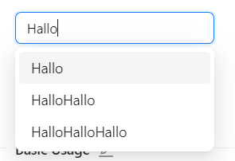
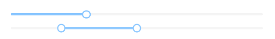

# Aufgabe 3.2: Verschiedene UI-Komponenten kennenlernen

## Auftrag
Erstellen Sie zwei Glossareinträge über Komponenten im Web. Beschreiben Sie folgende Punkte:

- Name und Synonyme dieser Komponente
- Einsatzzweck und Funktion in einem Absatz
- Video/Screenshots dieser Komponente (Desktop, Smartphone, …) dieser Komponente im Einsatz

Mögliche Quellen für Ihre Recherche:
- https://mui.com/material-ui/
- https://ant.design/components/overview/
- https://explore.fast.design
- https://mantine.dev/

### Vorlage
Accordion: Eine Komponente, die es ermöglicht, Inhalte in einer hierarchischen Struktur anzuzeigen und aus- und einzuklappen.

Multiselect: Ein UI-Element, das es Benutzern ermöglicht, mehrere Optionen aus einer Liste auszuwählen.

Date Picker: Ein UI-Element, das es Benutzern ermöglicht, Datumsangaben auszuwählen, indem sie auf einen Kalender klicken.

Autocomplete: Eine Komponente, die Vorschläge basierend auf dem eingegebenen Text anzeigt und erleichtert die Eingabe von Text.

Slider: Ein UI-Element, das es Benutzern ermöglicht, Werte aus einem bestimmten Bereich auszuwählen, indem sie einen Regler bewegen.

Progress Bar: Eine Komponente, die den Fortschritt einer Aktion anzeigt.

Carousel/Slideshow: Eine Komponente, die es ermöglicht, Bilder oder andere Inhalte in einer Diashow anzuzeigen.

Rating: Eine Komponente, die es Benutzern ermöglicht, eine Bewertung abzugeben, indem sie Sterne oder andere Symbole auswählen.

Treeview: Eine Komponente, die es ermöglicht, hierarchische Strukturen anzuzeigen und zu navigieren.

### Resultat

#### Glossareintrag 01 | Refresher

**Name** : Refresh Button 
**Synonyme** : Refresh Icon

**Einsatz**: Auf jeder Webseite oder App.
**Funktion**: Sie ist zuständing für um eine Webseite oder App nachzuladen.

#### Glossareintrag 02 | Searchbar

**Name** : Searchbar / Suchleiste
**Synonyme** : Search

**Einsatz**: Auf jeder Webseite oder App zu finden.
**Funktion**: Sie ist zuständing für um eine Webseite oder App interaktiver zu gestalten und das Suchverhalten zu verbessern in dem man dort sein gewünschtes Produkt eingibt und mit dem Enter button abschickt.

#### GLossareintrag 03 | Modal

**Name** : Modal
**Synonyme** : Benachrichtungs PopUp

**Einsatz** : 
Display a modal dialog box, providing a title, content area, and action buttons.

Denken Sie an das letzte Mal, als Sie ein Element auf Ihrem Telefon gelöscht haben. Die kleine Meldung, die auftauchte und Sie aufforderte, die Löschung zu bestätigen, ist ein modales Fenster.
**Funktion**
When requiring users to interact with the application, but without jumping to a new page and interrupting the user's workflow, you can use Modal to create a new floating layer over the current page to get user feedback or display information.

Ein modales Fenster ist ein kleines Kästchen mit einem Inhalt oder einer Nachricht, das Sie zur Interaktion auffordert, bevor Sie es schließen und zu Ihrem Arbeitsablauf zurückkehren können.

#### Glossareintrag 04 | Autocomplete

**Name** : Autocomplete
**Synonyme** : Automatisches Ausfüllen | Vorschlag Anzeige

**Einsatz** :
Ihr einsatz in jeglicher Form von Suchen. Ein gutes Beispiel wenn man ein bestimmtes Objekt in seiner Suche sucht und dann schon es ausgefüllt kriegt nur um anzuklicken.

**Funktion** :
Wenn Sie ein Eingabefeld anstelle eines Selektors benötigen.
Wenn Sie Eingabevorschläge oder Hilfetext benötigen.

#### Glossareintrag 05 | Slider

**Name** : Slider
**Synonyme** : Range

**Einsatz** :
Ein UI-Element, das es Benutzern ermöglicht, Werte aus einem bestimmten Bereich auszuwählen, indem sie einen Regler bewegen.

**Funktion** :
Um den Inputwert zu einem Range ändern.

#### Glossareintrag 06 | Datepicker

**Name** : Date-Picker
**Synonyme** :

**Einsatz** :
Der Date-Picker ist eine Komponente, mit der verschiedene Daten in einen Kalender eingetragen werden können. Man kann ein Datum und eine Uhrzeit eingeben, aber auch Daten in einem bestimmten Bereich. Er kann in Reise-Webseiten verwendet werden, um zu bestimmen, wann man reisen möchte.

**Funktion** : 
Der Date-Picker ist dazu da ein Datum herauszulesen.