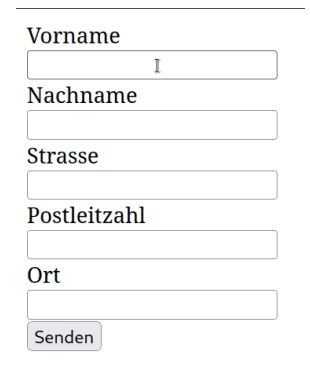
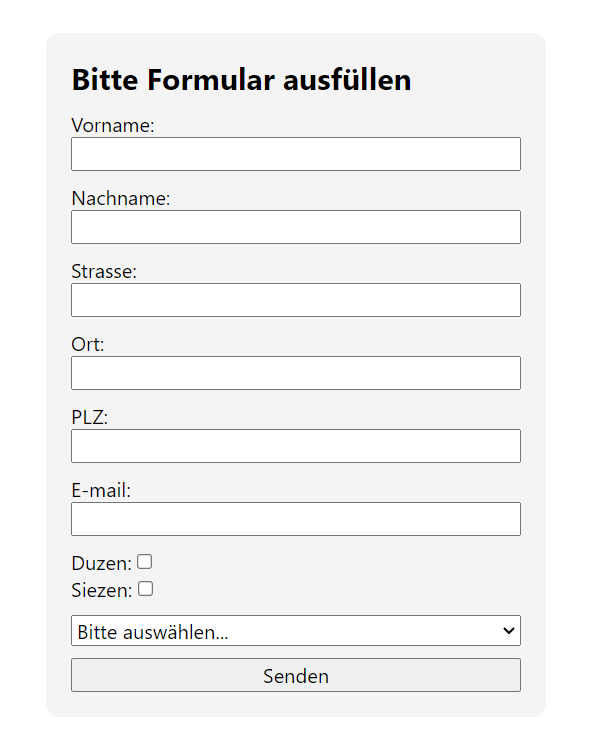

# Aufgabe 6.1: PLZ zu Ort zuordnen

## Auftrag
Erstellen Sie eine HTML Seite mit einem einfachen Adress-Formular. Wenn das Formular abgeschickt wird, sollen die Daten zusammengefasst in einer Liste aufgeführt werden. Fragen Sie mindestens folgende Angaben ab:

- Vor- und Nachname
- Strasse, PLZ und Ort
- E-Mail Adresse
- Du-Zie (Checkbox)
- Ob Sie diese Person aus Privat, Schule oder Geschäft kennen (Radio oder Select)

### Vorlage


### Resultat

[index.html](./Content/index.html)
[root.css](./Content/root.css)



```html
<form name="" action="post">

        <h1>Bitte Formular ausfüllen</h1>

        <!-- Vorname -->
        <div class="field">
            <label for="vorname">Vorname:</label>
            <input type="text" name="Vorname" id="vorname">
        </div>
        <!-- Nachname -->
        <div class="field">
            <label for="nachname">Nachname:</label>
            <input type="text" name="Nachname" id="nachname">
        </div>
        <!-- Strasse -->
        <div class="field">
            <label for="strasse">Strasse:</label>
            <input type="text" name="Strasse" id="strasse">
        </div>
        <!-- Ortschaft: -->
        <div class="field">
            <label for="ort">Ort:</label>
            <input type="text" name="Ort" id="ort">
        </div>
        <!-- Postleitzahl -->
        <div class="field">
            <label for="plz">PLZ:</label>
            <input type="number" name="PLZ" id="plz" maxlength="4">
        </div>

        <!-- Emailadresse -->
        <div class="field">
            <label for="email">E-mail:</label>
            <input type="email" name="E-mail" id="email">
        </div>

        <!-- Duzen oder Siezen -->
        <div class="field">
            <div class="checkbox">
                <label for="duzen">Duzen:</label>
                <input type="checkbox" name="Duzen" id="duzen">
            </div>
            <div class="checkbox">
                <label for="siezen">Siezen:</label>
                <input type="checkbox" name="Siezen" id="siezen">
            </div>
        </div>

        <!-- Bekannt? -->
        <div class="field">
            <select name="Bekannt von" id="meet">
                <option value="none" selected disabled>Bitte auswählen...</option>
                <option value="privat">Privat</option>
                <option value="schule">Schule</option>
                <option value="geschaeft">Geschäft</option>
            </select>
        </div>

        <div class="field">
            <input type="submit" name="Absenden" id="submit">
        </div>

    </form>
```