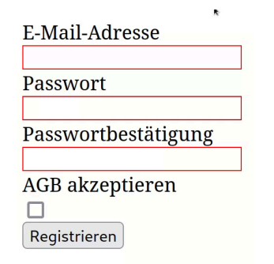
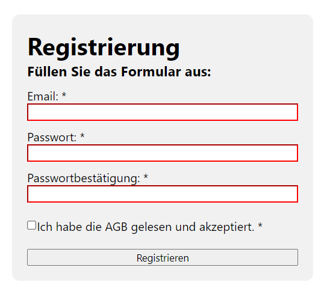

# Aufgabe 6.1: PLZ zu Ort zuordnen

## Auftrag
Oftmals soll das Passwort bei einer Registrierung zur Überprüfung der Richtigkeit bestätigt werden. Diese
Validierung soll mit Hilfe von HTML5 und der Validation API implementiert werden.

1. Erstellen Sie eine neue HTML-Seite mit einem Formular.
2. Es soll zwei Passwortfelder mit entsprechenden Labels geben.
3. Benutzen Sie die Selektoren :invalid und :valid um gültige und ungültige Formularfelder eindeutig zu kennzeichnen.
4. Fügen Sie einen Submit-Button hinzu.
5. Implementieren Sie die Validierung des Passworts, sobald das Formular losgeschickt wird.
6. Zeigen Sie entsprechende Fehlermeldungen an, wenn die Validierung nicht erfolgreich war.
7. Fügen Sie weitere HTML Validierungsregeln (bspw. required, minlength, ...) hinzu.
8. Testen Sie das Resultat.

### Vorlage

### Resultat

[index.html](./Content/index.html)
[root.css](./Content/root.css)
[app.js](./Content/app.js)

