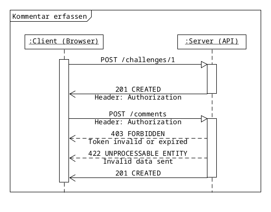

# Auftrag 7.2: Kommentare erfassen

Entwickeln Sie das Formular, um Kommentare zu einer Seite hinzuzufügen. Der Kursleiter stellt Ihnen den Server zur Verfügung: 10.65.4.20

Bevor der Kommentar erstellt werden kann, muss ein Zugriffstoken abgeholt werden. Dazu muss eine POST-Anfrage an /challenges/1 gesendet werden, um das Token zu erstellen.

Senden Sie Ihr Token mit dem Kommentar nun per POST Anfrage an /comments.

Ein Kommentar hat folgende JSON Struktur:

```json

{
  "message": "Ihre Nachricht",
  "username": "Hans Müller"
}

```



### Auftrag

1. Erstellen Sie ein Formular, um Kommentare hinzuzufügen. Es soll eine Nachricht (min. 3 Zeichen, max. 300 Zeichen) und ein Benutzername (min. 3 Zeichen, max. 16 Zeichen) angegeben werden können.
2. Sobald der Benutzer das Formular absendet, machen Sie eine POST-Anfrage an /challenges/1, um ein Token fürs Erstellen des Kommentars abzuholen. Das Token ist nur 3 Sekunden gültig.
3. Senden Sie die verlangten Daten per POST-Anfrage an /comments.
4. Überprüfen Sie, ob der Kommentar an der Leinwand erscheint.

### Hinweise 

- Den Quellcode des Servers finden Sie hier: https://github.com/openscript/comment-me-learning-challenge
- Der Kursleiter stellt einen Server allen Teilnehmer zur Verfügung. Falls dennoch der Server lokal gestartet werden soll, muss Docker installiert werden. Danach kann der Server mit docker run -i -t -p 80:3000 ghcr.io/openscript/comment-me-learning-challenge:latest gestartet werden.

### Abgabe

```JavaScript

const card = document.forms.register;
const message = card.elements.message;
const user = card.elements.username;

card.addEventListener('submit', async (event) => {
    event.preventDefault();

    const Infos = new FormData(event.target);

    console.log(JSON.stringify(Infos));

    const request = await fetch('http://10.65.4.20/challenges/1', {
        method: 'POST',
    });

    let Auth = await request.headers.get('Authorization');

    console.log(Auth);

    const myMessage = await fetch('http://10.65.4.20/comments', {
        method: 'POST',
        headers: { 
            "Content-Type": "application/json",
            "Authorization" : Auth,
         },
        body: JSON.stringify(
            {
                "message" : message.value,
                "username" : user.value,
            }
        ),
    });


});

```