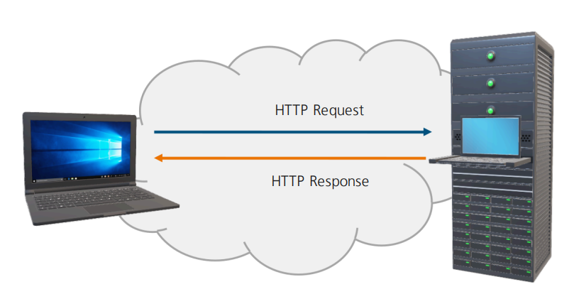
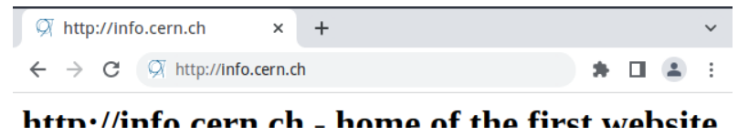
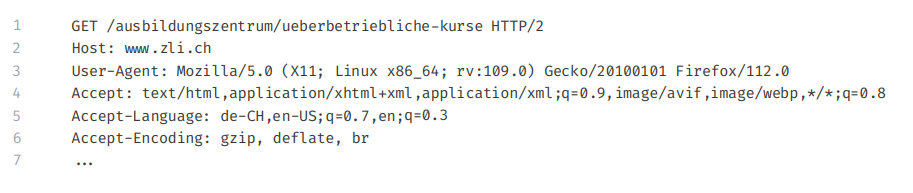
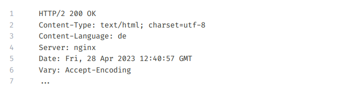
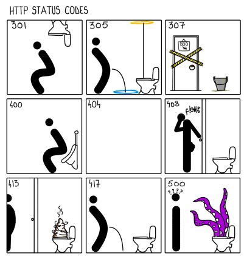

# Modul Tag 1
> [!NOTE]
> -  Ich formuliere HTTP-Abfragen.
> - Ich versende HTTP-Abfragen.
> - Ich werte die Resultate von HTTP-Abfragen aus.

# Inhaltsverzeichnis
#### Block 1
- [Kommunikation im World Wide Web](#kommunikation-im-world-wide-web)
- [HTTP-Schnittstellen](#http-schnittstellen)
- [HyperText Transfer Protocol (HTTP) (1)](#hypertext-transfer-protocol-http-1)
- [HyperText Transfer Protocol (HTTP) (2)](#hypertext-transfer-protocol-http-2)
- [HyperText Transfer Protocol (HTTP) (3)](#hypertext-transfer-protocol-http-3)
- [HTTP Statuscodes (1)](#http-statuscodes-1)
- [HTTP Statuscodes (2)](#http-statuscodes-2)
- [Methods](#methods)

#### Block 2
- [DOM Grundlagen](#dom-grundlagen)

---

# Block 7 | Kommunikation zwischen Front- und Backend

---

# Kommunikation im World Wide Web

---

# HTTP-Schnittstellen

- **Address**: Die eindeutige URL (Uniform Resource Locator), die eine Ressource oder einen Endpunkt im Web identifiziert, zu dem die HTTP-Anfrage gesendet wird (z.B. https://example.com/api/users).
- **Headers**: Schlüssel-Wert-Paare, die zusätzliche Informationen über den HTTP-Anforderer und die Anfrage selbst enthalten (z.B. Content-Type, Authorization).
- **Methods**: HTTP-Verben, die angeben, welche Aktion auf der angeforderten Ressource durchgeführt werden soll (z.B. GET, POST, PUT, DELETE).
- **Body**: Daten, die bei bestimmten HTTP-Methoden (z.B. POST, PUT) an den Server gesendet werden, um Ressourcen zu erstellen oder zu aktualisieren.
- **Status Codes**: Dreistellige Zahlen, die das Ergebnis der HTTP-Anfrage anzeigen (z.B. 200 OK, 404 Not Found, 500 Internal Server Error).

---

# HyperText Transfer Protocol (HTTP) (1)

- Seit Anfang an die Art, wie der Browser mit dem World Wide Web spricht
- Client fragen Server ab (Requests) und ein Server antwortet (Response) dem Client.
- Zustandslos (Stateless)
- Sicher nur Dank der Erweiterung HTTPS

---

# HyperText Transfer Protocol (HTTP) (2)

---

# HyperText Transfer Protocol (HTTP) (3)

---

# HTTP Statuscodes (1)

Server senden mit der Antwort einen Statuscode mit,
welche wie folgt kategorisiert sind:

- **Informationen** von 100 bis 199
- **Erfolge** von 200 bis 299
- **Weiterleitungen** von 300 bis 399
- **Clientseitige** **Fehler** von 400 bis 499
- **Serverseitige** **Fehler** von 500 bis 599

[Lesen: Statuscodes](https://developer.mozilla.org/en-US/docs/Web/HTTP/Status)

--- 

# HTTP Statuscodes (2)

- '301' Moved Permanrntly
- '305' Use Proxy
- '307' Temporary Redirect
- '400' Bad Request
- '404' Not Found
- '408' Request Timeout
- '413' Payload Too Large
- '417' Excaption Failed

---

# Methods

Die Methode beschreibt die Aktion einer Anfrage (Request):

- GET : Daten Abrufen
- POST : Daten senden, häufig für Formulare...
- PUT : Daten Aktualisieren
- DELETE : Daten Löschen

Weitere Methoden: HEAD, OPTIONS, PATCH, ...

[HTTP request methods](https://developer.mozilla.org/en-US/docs/Web/HTTP/Methods)

--- 

# HTTP Headers

Zusätzliche Informationen zur Anfrage (Request) und zur Antwort (Response) können in sogenannten Headers hinterlegt werden:

Request | Response |
-------- | -------- | 
Host   | Content-Type   | 
Referer   | Server   | 
User-Agent   | Cache-Control   | 
Accept, Accept-Encoding, Accept-Language   | Keep-Alive   | 
Authorization   | Set-Cookie   | 
Content-Type   | Authorization   | 

---